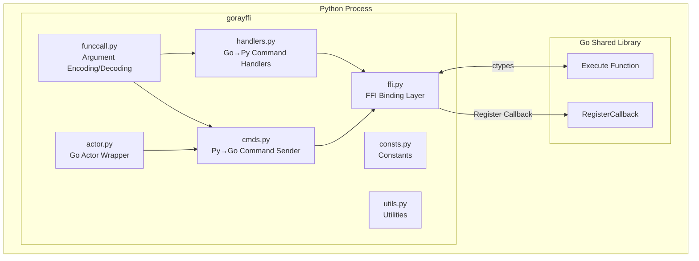
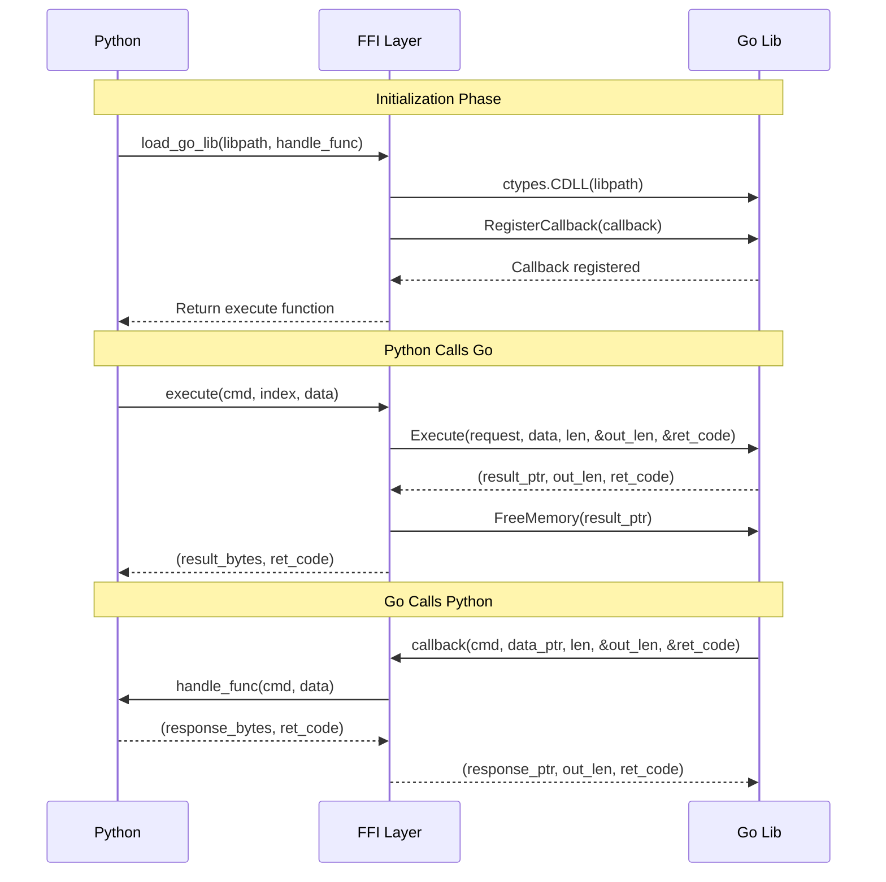
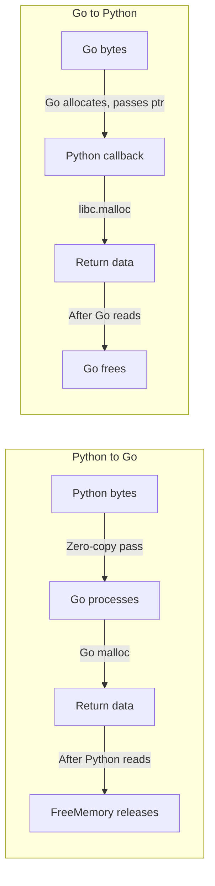
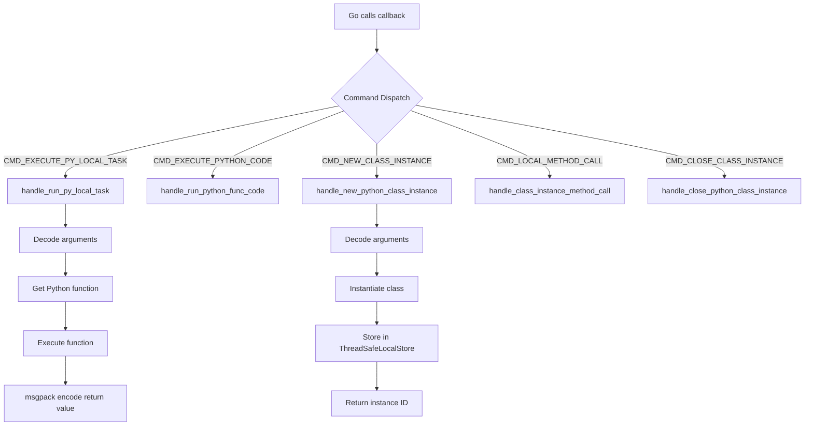
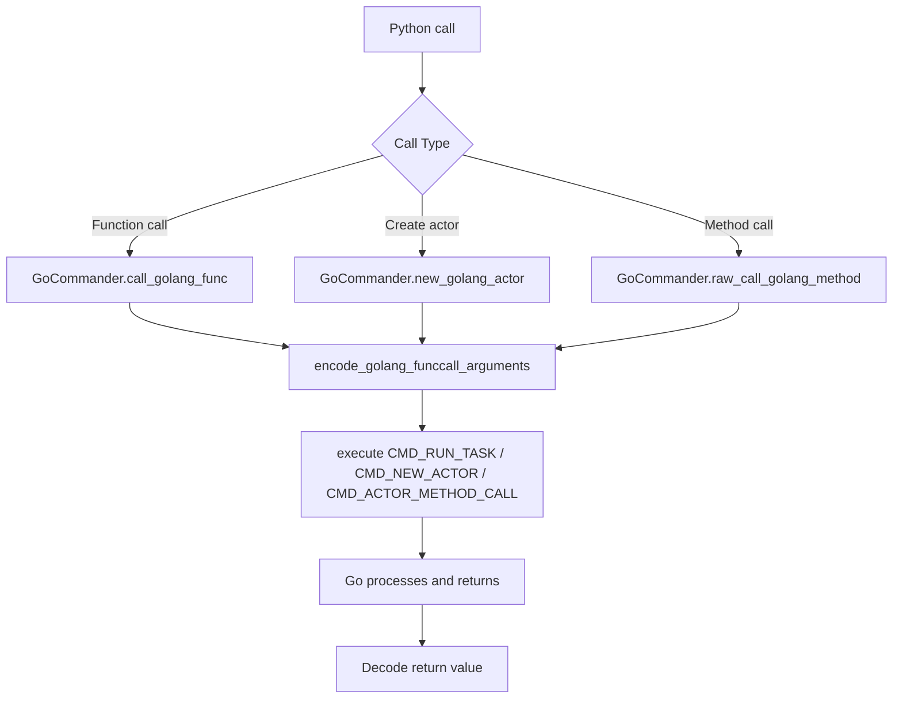

# gorayffi - Internal Implementation Guide

This document is intended for codebase maintainers, providing detailed explanations of the internal implementation of the gorayffi module.

## Overview

The `gorayffi` module is the Python-side infrastructure for the GoRay project, enabling bidirectional in-process calls between Python and Go. This module **does not depend on Ray**, making it suitable for other projects requiring Go-Python interop, such as gopylink.

### Core Features

1. **FFI Binding Layer** - Loads Go shared libraries via ctypes and establishes Python ↔ Go communication channels
2. **Go → Python Calls** - Allows Go code to call Python functions and classes
3. **Python → Go Calls** - Allows Python code to call Go functions and classes
4. **Data Serialization** - Cross-language data exchange based on msgpack

## Architecture Overview



## File Responsibilities

| File | Responsibility |
|------|----------------|
| `ffi.py` | Core FFI implementation; loads Go shared library and establishes bidirectional communication |
| `consts.py` | Defines command enums (Go2PyCmd, Py2GoCmd) and error codes (ErrCode) |
| `handlers.py` | Implements handlers for Go → Python commands |
| `cmds.py` | Encapsulates Python → Go command sending logic (GoCommander class) |
| `funccall.py` | Encoding/decoding utilities for function call arguments |
| `actor.py` | Go Actor wrapper classes for Python |
| `utils.py` | General utilities (logging, thread-safe storage, etc.) |
| `__init__.py` | Module entry point; integrates load_go_lib function |

## FFI Binding Layer Details

### Communication Architecture



### Go Shared Library C API

The Go shared library must export the following C functions:

```c
// Entry point for Python to call Go
void* Execute(
    long long request,      // Command type | index << 10
    void* in_data,          // Input data pointer
    long long data_len,     // Input data length
    long long* out_len,     // [out] Output data length
    long long* ret_code     // [out] Return code
);

// Free memory allocated by Go
void FreeMemory(void* ptr);

// Register Python callback function
void RegisterCallback(
    void* (*callback)(long long, void*, long long, long long*, long long*)
);
```

### Request Encoding

Python → Go requests pass command information via the `request` parameter:

```
request = cmd | (index << cmdBitsLen)
```

Where `cmdBitsLen = 10`, so:
- Lower 10 bits: Command type (Py2GoCmd enum value)
- Upper 54 bits: Extra index information (e.g., actor instance ID)

### Memory Management Strategy



**Python → Go:**
- Input bytes: Allocated by Python, automatically freed by Python after Execute returns
- Return bytes: Allocated by Go (malloc), Python calls `FreeMemory` to release after reading

**Go → Python:**
- Input bytes: Allocated by Go, automatically freed by Go after callback returns
- Return bytes: Allocated by Python using `libc.malloc`, Go is responsible for freeing

## Command Protocol

### Command Enum Definitions

**Go → Python Commands (`Go2PyCmd`):**

| Command | Value | Purpose |
|---------|-------|---------|
| `CMD_EXECUTE_PY_LOCAL_TASK` | 0 | Execute a Python function |
| `CMD_EXECUTE_PYTHON_CODE` | 1 | Execute arbitrary Python code |
| `CMD_NEW_CLASS_INSTANCE` | 2 | Create a Python class instance |
| `CMD_LOCAL_METHOD_CALL` | 3 | Call a method on a Python instance |
| `CMD_CLOSE_CLASS_INSTANCE` | 4 | Close a Python instance |
| `CMD_EXECUTE_REMOTE_TASK` | 5+ | Ray remote task related (handled in goray package) |

**Python → Go Commands (`Py2GoCmd`):**

| Command | Value | Purpose |
|---------|-------|---------|
| `CMD_GET_INIT_OPTIONS` | 0 | Get ray.Init() configuration |
| `CMD_START_DRIVER` | 1 | Start Go driver function |
| `CMD_GET_TASK_ACTOR_LIST` | 2 | Get list of registered tasks/actors |
| `CMD_GET_ACTOR_METHODS` | 3 | Get actor's method list |
| `CMD_RUN_TASK` | 4 | Execute a Go function |
| `CMD_NEW_ACTOR` | 5 | Create a Go actor instance |
| `CMD_ACTOR_METHOD_CALL` | 6 | Call a Go actor method |
| `CMD_CLOSE_ACTOR` | 7 | Close a Go actor instance |

## Data Serialization Format

### Function Call Argument Encoding

**Python → Go (`encode_golang_funccall_arguments`):**

```
┌──────────────────────────────────────────────────────────────────┐
│                    Multiple bytes units                          │
├──────────────────────────────────────────────────────────────────┤
│ unit[0]: Function/Actor/Method name (UTF-8 encoded)              │
├──────────────────────────────────────────────────────────────────┤
│ unit[1]: msgpack-encoded argument list                           │
├──────────────────────────────────────────────────────────────────┤
│ unit[2..n]: Resolved ObjectRef data (optional)                   │
│   Format: | arg_position: 8-byte int64 LE | data: []byte |       │
└──────────────────────────────────────────────────────────────────┘

Each unit format:
┌─────────────────┬──────────────────────────┐
│ length: 8 bytes │ data: length bytes       │
│ (int64 LE)      │                          │
└─────────────────┴──────────────────────────┘
```

**Go → Python (`decode_funccall_arguments`):**

```
┌──────────────────────────────────────────────────────────────────┐
│ unit[0]: msgpack-encoded argument data                           │
├──────────────────────────────────────────────────────────────────┤
│ unit[1]: JSON-encoded options dictionary                         │
│   Contains: goray_task_name / goray_actor_type_name, etc.        │
└──────────────────────────────────────────────────────────────────┘
```

### msgpack Serialization

All function arguments and return values use msgpack serialization:

```python
# Encoding
encoded = msgpack.packb(value, use_bin_type=True)

# Decoding (supports multiple return values)
returns = list(msgpack.Unpacker(io.BytesIO(data), strict_map_key=False))
```

## Go → Python Call Flow



### Python Instance Management

`handlers.py` uses `ThreadSafeLocalStore` to manage Python class instances:

```python
class_instances_store = ThreadSafeLocalStore()

# When creating an instance
instance_id = class_instances_store.add(instance)  # Returns integer ID

# When calling a method
obj_handle = class_instances_store[instance_id]
result = getattr(obj_handle, method_name)(*args)

# When closing an instance
class_instances_store.release(instance_id)
```

`ThreadSafeLocalStore` characteristics:
- Thread-safe (uses threading.Lock)
- Local storage (resets on pickle, avoiding cross-process transfer)
- ID reuse strategy similar to process ID allocation (delayed reuse of released IDs)

## Python → Go Call Flow



### GoCommander Class

`GoCommander` is the core wrapper for Python calling Go:

```python
class GoCommander:
    def __init__(self, cmd_execute_func):
        self.execute = cmd_execute_func  # Function returned by ffi.load_go_lib

    # High-level API - automatic encoding/decoding
    def call_golang_func(self, func_name: str, args: tuple) -> Any

    # Low-level API - raw bytes operations
    def raw_call_golang_func(self, func_name, raw_args, object_positions, *resolved_refs)
    def raw_call_golang_method(self, go_obj_id, method_name, encoded_args, ...)
```

## Go Actor Wrappers

`actor.py` provides two Go Actor wrapper classes:

### GoActor - Low-level Wrapper

Used internally by the Ray framework, supports creation from Go or Python:

```python
class GoActor:
    def __init__(self, cmder, actor_class_name, caller_type, ...):
        # caller_type distinguishes call origin
        if caller_type == CallerLang.Python:
            # Python native arguments, need encoding first
            go_encoded_args = _encode_native_args(*args)
        else:
            # Already-encoded arguments from Go
            ...

        # Create Go instance
        self.go_instance_index = cmder.new_golang_actor(...)

    # Encoded arguments call (used by Go)
    def call_method_with_encoded_args(self, method_name, encoded_args, ...)

    # Native arguments call (used by Python)
    def call_method_with_native_args(self, method_name, *args)
```

### GolangLocalActor - High-level Wrapper

For Python local calls, provides a Pythonic interface:

```python
class GolangLocalActor:
    def __init__(self, cmder, actor_class_name, *args):
        self._method_names = cmder.get_golang_actor_methods(actor_class_name)
        self._actor = GoActor(cmder, actor_class_name, CallerLang.Python, ...)

    def __getattr__(self, name):
        # Dynamic method call: actor.method_name(*args)
        return functools.partial(self._actor.call_method_with_native_args, name)

    def __del__(self):
        # Close Go actor on destruction
        self._cmder.close_actor(self._actor.go_instance_index)
```

## Module Entry Point

`__init__.py` provides a unified entry point:

```python
def load_go_lib(libpath, cmd_handlers) -> GoCommander:
    """
    Load Go shared library and return a GoCommander instance.

    Args:
        libpath: Path to Go shared library
        cmd_handlers: Go → Python command handlers dictionary
            {Go2PyCmd.XXX: handler_func, ...}

    Returns:
        GoCommander instance for Python → Go calls
    """
    cmder = ffi.load_go_lib(libpath, _cmds_dispatcher(cmd_handlers))
    return GoCommander(cmder)
```

## Constants

Key constants (defined in `consts.py`):

```python
# Environment variables
GORAY_BIN_PATH_ENV = "GORAY_BIN_PATH"              # Go binary path
GORAY_PY_MUDULE_PATH_ENV = "GORAY_PY_MUDULE_PATH"  # Python module path

# Option keys
PY_LOCAL_ACTOR_ID_KEY = "goray_py_local_actor_id"    # Python instance ID
TASK_NAME_OPTION_KEY = "goray_task_name"              # Function name
ACTOR_NAME_OPTION_KEY = "goray_actor_type_name"       # Actor class name
ACTOR_METHOD_LIST_OPTION_KEY = "goray_actor_methods"  # Actor method list
```

## Error Handling

Error code enum (ErrCode):

| Error Code | Value | Meaning |
|------------|-------|---------|
| `Success` | 0 | Success |
| `Failed` | 1 | General failure |
| `Timeout` | 2 | Timeout |
| `Cancelled` | 3 | Cancelled |
| `ObjectRefNotFound` | 4 | ObjectRef not found |

Error message formatting (`utils.error_msg`):
```python
def error_msg(msg: str, frame_index: int = 0) -> bytes:
    # Returns format: "[ERROR]@filename:lineno message "
    fname, lineno = _get_caller_info(frame_index + 1)
    return f"[ERROR]@{fname}:{lineno} {msg} ".encode("utf-8")
```

## Debugging

Set environment variable to enable debug logging:

```bash
export GORAY_DEBUG_LOGGING=1
```

This enables DEBUG level log output for all `gorayffi` modules.

## Further Reading

- [GoRay Cross-Language Programming Guide](../docs/crosslang.md) - User-facing cross-language call guide
- [Cross-Language Type Conversion Guide](../docs/crosslang_types.md) - Python ↔ Go type mapping rules
