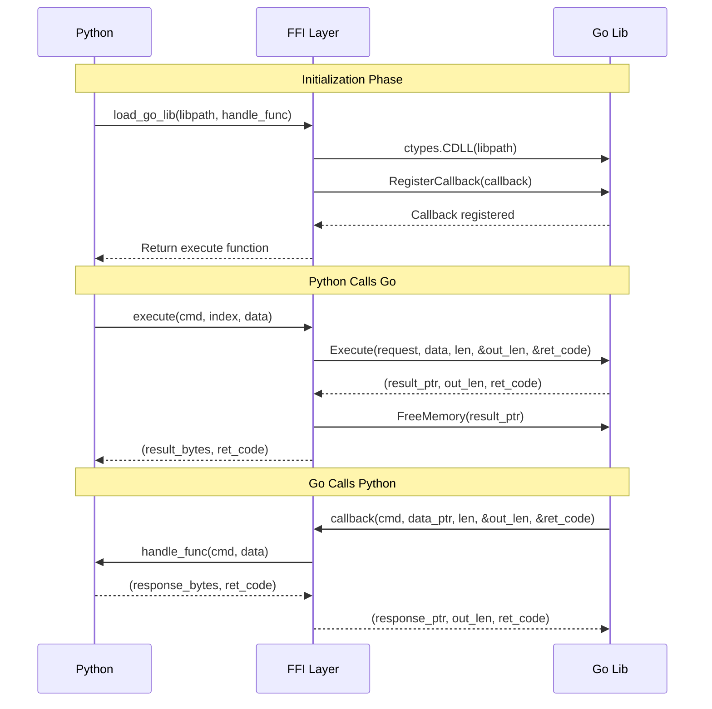

# Internal Implementation of `gorayffi`

The `gorayffi` module provides Python-side infrastructure for the GoRay project.

## Overview

This package provides:

1. **FFI Binding Layer** - Loads Go shared libraries via ctypes and establishes Python ↔ Go communication channels
2. **Go → Python Calls** - Allows Go code to call Python functions and classes
3. **Python → Go Calls** - Allows Python code to call Go functions and classes
4. Define underlying types & utils & consts.

This package doesn't require ray package at all. So it can be also used
in [gopylink](https://github.com/ray4go/GoPyLink) project.
Through, this package keep the flexibility to be used in remote call scenarios.

| File          | Responsibility                                                                               |
|---------------|----------------------------------------------------------------------------------------------|
| `ffi.py`      | Core FFI implementation; loads Go shared library and establishes bidirectional communication |
| `consts.py`   | Defines command enums (Go2PyCmd, Py2GoCmd) and error codes (ErrCode)                         |
| `handlers.py` | Implements handlers for Go → Python commands                                                 |
| `cmds.py`     | Encapsulates Python → Go command logic (GoCommander class)                                   |
| `funccall.py` | Encoding/decoding utilities for function call arguments                                      |
| `actor.py`    | Go Class/Actor wrapper classes for Python                                                    |
| `utils.py`    | General utilities (logging, thread-safe storage, etc.)                                       |
| `__init__.py` | Module entry point; integrates `load_go_lib` function                                        |

## FFI bindings layer

The FFI bindings layer builds a command-based protocol between python and golang.

### Python-side API

For python, this layer provides `load_go_lib` api to load go shared library and register a handle function to process
commands from golang.

```python
# ffi.py
def load_go_lib(
    libpath: str,
    handle_func: Callable[[int, bytes], tuple[bytes, int]],
) -> Callable[[int, int, bytes], tuple[bytes, int]]
```

The `handle_func` is the function to process commands from golang. It has the following signature:

```python
def handle_func(cmd: int, data: bytes) -> tuple[bytes, int]:
    """
    Process the command from golang.

    Args:
        cmd: The command to handle.
        data: The data to handle.

    Returns:
        The response to send to golang: (data, ret_code)
    """
```

`load_go_lib()` returns a function, which is used to send commands to golang and has the following signature:

```python
def execute(cmd: int, index: int, data: bytes) -> tuple[bytes, int]:
    """
    Send a command to golang.

    Args:
        cmd: The command to send to golang.
        index: extra int32 info to send to golang.
        data: The data to send to golang.

    Returns:
        The response from golang: (data, ret_code)
    """
```

### Go-side API

The Go shared library exports the following C functions:

```c
// Entry point for Python to call Go
void* Execute(
    long long request,      // Command type | index << 10
    void* in_data,          // Input data pointer
    long long data_len,     // Input data length
    long long* out_len,     // [out] Output data length
    long long* ret_code     // [out] Return code
);

// Free memory allocated by Go
void FreeMemory(void* ptr);

// Register Python callback function
void RegisterCallback(
    void* (*callback)(long long request, void* in_data, long long in_len, long long* out_len, long long* ret_code)
);
```

### Communication Flow



The solid line represents the call flow. The dashed line represents the return flow.

## Cross Language Call Layer

Based on the FFI bindings layer, we establish a bidirectional command-based protocol:

**Go → Python** (`Go2PyCmd`):

- `CMD_EXECUTE_PY_LOCAL_TASK`: Execute a Python function
- `CMD_EXECUTE_PYTHON_CODE`: Execute arbitrary Python code
- `CMD_NEW_CLASS_INSTANCE`: Create a Python class instance
- `CMD_LOCAL_METHOD_CALL`: Call a method on a Python instance
- `CMD_CLOSE_CLASS_INSTANCE`: Close a Python instance

**Python → Go** (`Py2GoCmd`):

- `CMD_RUN_TASK`: Execute a Go function
- `CMD_NEW_ACTOR`: Create a Go class instance
- `CMD_ACTOR_METHOD_CALL`: Call a method on a Go instance
- `CMD_CLOSE_ACTOR`: Close a Go instance

With those commands, we can build a cross language call layer.

### Call python func and class from golang

The [handlers.py](handlers.py) implements Go → Python commands handlers.

Each command is dispatched to a corresponding handler function in `handle_xxx(data: bytes) -> tuple[bytes, int]`.

**Function/class/method call arguments**

For CMD_RUN_TASK/CMD_NEW_ACTOR/CMD_ACTOR_METHOD_CALL, the function/class/method arguments are serialized to `data` in
golang side,
the format is:

```
┌──────────────────────────────────────────────────────────────────┐
│                        2 bytes units                             │
├──────────────────────────────────────────────────────────────────┤
│ unit[0]: msgpack-encoded argument list                           │
├──────────────────────────────────────────────────────────────────┤
│ unit[1]: json-encoded metas                                      │
|   (function name, class name, method name, class instance id)    │
└──────────────────────────────────────────────────────────────────┘

Each unit format:
┌─────────────────┬──────────────────────────┐
│ length: 8 bytes │ data: length bytes       │
│ (int64 LE)      │                          │
└─────────────────┴──────────────────────────┘
```

The return value of CMD_RUN_TASK/CMD_ACTOR_METHOD_CALL is serialized to bytes via msgpack in python side.

### Call golang func and class from python

The [cmds.py](cmds.py) implements Python → Go commands. The apis to call golang funcs & methods are designed to both
support local call and remote call. So the api may seem weird at first glance.

**Function call (Py2GoCmd.RUN_TASK)**:

```python
def raw_call_golang_func(
    func_name: str,
    raw_args: bytes,
    object_positions: list[int],
    *resolved_object_refs: tuple[bytes, int],
) -> tuple[bytes, int]
```

**Class call (Py2GoCmd.NEW_ACTOR)**:

```python
def new_golang_actor(
    actor_class_name: str,
    encoded_args: bytes,
    object_positions: list[int],
    *object_refs: tuple[bytes, int],
) -> int
```

**Class method call (Py2GoCmd.ACTOR_METHOD_CALL)**:

```python
def raw_call_golang_method(
    go_obj_id: int,
    method_name: str,
    encoded_args: bytes,
    object_positions: list[int],
    *object_refs: tuple[bytes, int],
) -> tuple[bytes, int]
```

Those args are serialized to bytes in python side, and send to golang side via
`execute(cmd: int, index: int, data: bytes)`.

The `data` format is (see `funccall.encode_golang_funccall_arguments()`):

```
┌──────────────────────────────────────────────────────────────────┐
│                    Multiple bytes units                          │
├──────────────────────────────────────────────────────────────────┤
│ unit[0]: Function/Class/Method name (UTF-8 encoded)              │
├──────────────────────────────────────────────────────────────────┤
│ unit[1]: msgpack-encoded argument list                           │
├──────────────────────────────────────────────────────────────────┤
│ unit[2..n]: Resolved ObjectRef data (optional)                   │
│   Format: | arg_position: 8-byte int64 LE | data: []byte |       │
└──────────────────────────────────────────────────────────────────┘
```

The `index` is only used to specify `go_obj_id` in `Py2GoCmd.ACTOR_METHOD_CALL`.

The `object_positions` and `object_refs` are used in remote call and are not used in local call.
